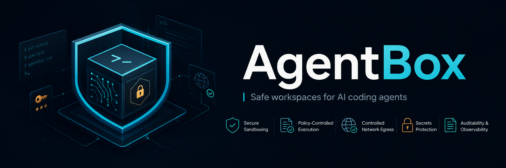
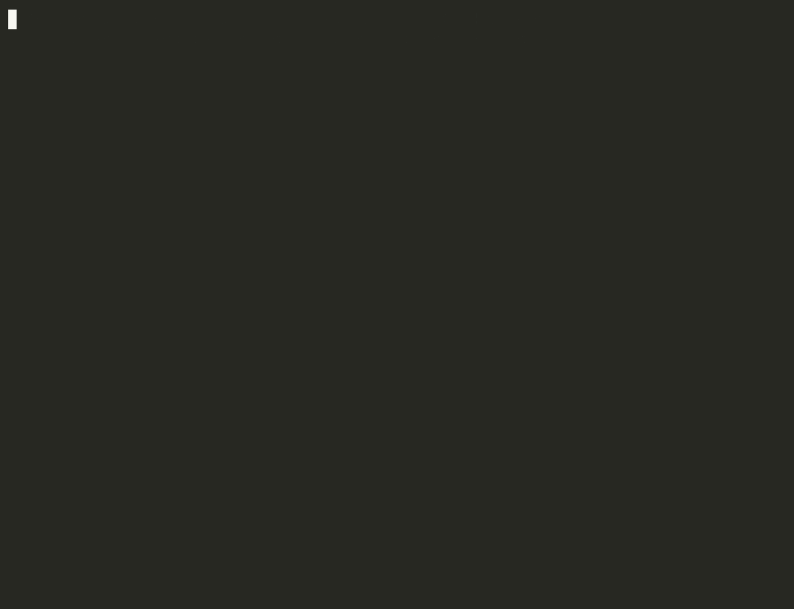

<p align="center">
  
</p>

# AgentBox

<p align="center">
  <a href="https://github.com/qosikz/agentbox/releases/latest"></a>
  <a href="https://github.com/qosikz/agentbox/actions/workflows/ci.yml"></a>
  <a href="go.mod"></a>
  <a href="LICENSE"></a>
  <a href="#verifying-releases"></a>
  <a href="https://github.com/qosikz/agentbox/pkgs/container/agentbox%2Fruntime"></a>
</p>

**Safe workspaces for AI coding agents — and a sandbox your agent harness can drive.**

AgentBox runs AI coding agents (Claude Code, Codex, Gemini, Goose, OpenCode, or
**any custom shell agent**) in isolated, reproducible, policy-controlled
workspaces — so an agent can edit a real repository without uncontrolled access
to your secrets, network, host filesystem, or MCP tools. Every run leaves an
auditable session record.

It works in **both directions**: point AgentBox at an agent, **or** let an agent
harness — Claude Code, [OpenClaw](#use-agentbox-from-your-agent-harness-integration),
Hermes Agent, or any MCP/skill-capable harness — call AgentBox as its *safety
sandbox* to test risky commands, validate generated code, and vet new tools or
subagents before trusting them. Via `agentbox exec`, an MCP server, or a
cross-harness skill.

<p align="center">
  
</p>

> _A sandboxed agent holds a **live API key** — and has nowhere to leak it. Your one allowed API stays reachable; the attacker host is refused at the proxy (fail closed); and even when the agent dumps the key into its output, the audit record **redacts** it. ~60s, all real. ([how it's recorded](demo/))_

```bash
agentbox run "fix failing tests"
```

```text
AgentBox session started

Repository: .
Agent: custom
Runtime: docker
Network: deny
Policy: agentbox.yaml

✓ Workspace created
✓ Policy applied
✓ Secrets protected
✓ Agent completed
✓ Diff generated
✓ Session saved
```

> **Status: active development (v0.4.1).** Dry-run, sessions, policy, MCP
> scanning, real container execution (Docker or Podman), **enforced network
> egress** (allowlist), harness integration (`exec` / `mcp serve` / `skill`),
> and baked-in containerized agents are supported. A signed default runtime
> image is published and pulled automatically, so the **sandbox runs out of the
> box** — `agentbox exec` proves isolation, network-deny, recording, and
> diff/audit with no setup; add a real agent when you want it to make edits (see
> [Two ways to start](#two-ways-to-start) and
> [Verifying releases](#verifying-releases)).

## Add AgentBox to your agent harness

Give your agent a sandbox in ~30 seconds. [Install AgentBox](#install), then
drop the skill into the harness you use — it teaches the agent *when* to
sandbox and *how* to call AgentBox:

```bash
agentbox skill install --target claude-project
# targets: claude-project | claude-user | openclaw | hermes | agents
```

The harness discovers the `SKILL.md` automatically. Now the agent can run
anything risky in an isolated container instead of on your host, and read the
exit code, diff, and output back:

```bash
agentbox exec "npm install && npm test"   # host untouched; recorded as a session
```

Prefer structured tools over shell calls? Expose AgentBox over MCP instead:

```bash
claude mcp add agentbox -- agentbox mcp serve   # also: openclaw · codex · gemini
```

Works with Claude Code, **OpenClaw** (`~/.openclaw/workspace/skills`), **Hermes
Agent** (`~/.hermes/skills`), and any agentskills.io-compatible harness
(`~/.agents/skills`). Unsafe modes are never reachable through the skill or the
MCP server, so a harness can't escalate past your `agentbox.yaml`.
→ [Full guide](#use-agentbox-from-your-agent-harness-integration).

## Why

AI coding agents can read code, run commands, install dependencies, open PRs, and
call MCP tools. Run directly on your machine, they can leak `.env` files, SSH
keys, and cloud credentials, reach any network endpoint, and run destructive
commands. AgentBox puts deterministic guardrails around them:

- **Secrets** — the host environment (including `PATH` and `HOME`) is never
  forwarded; containers get a standard `PATH`, `HOME` set to the workspace,
  `LANG`/`TERM`, and explicitly allowlisted secrets only. Secret-shaped values
  are redacted from logs.
- **Filesystem** — sensitive paths (`.env`, `~/.ssh`, `~/.aws`, `~/.kube`, the
  Docker socket) are excluded from the workspace by default.
- **Network** — denied by default. `allowlist` is **enforced** for container
  runs: the agent's only interface is an isolated per-run network whose sole
  exit is an egress proxy restricted to your `network.allow` domains — anything
  else fails closed, and every allow/deny is recorded in the session. `open`
  requires explicit unsafe confirmation.
- **Runtime** — containers run as a non-root user with `--cap-drop ALL` and
  `--security-opt no-new-privileges`; never privileged, never the Docker socket.
  Works with Docker or Podman.
- **MCP** — a static scanner flags dangerous MCP server capabilities before you trust them.
- **Audit** — every run is recorded under `.agentbox/sessions/<id>/`.

There's a second ~60s demo of the enforced-egress mechanics on their own —
allowlist one domain, DNS dead, everything else fails closed, all audited:
**[`demo/egress.gif`](demo/egress.gif)** ([all demos](demo/)).

AgentBox does not make an unsafe agent magically safe. It creates guardrails, and
it is honest about what it does and does not enforce.

## Install

**Prebuilt binaries:**

Download the binary for your platform from
[GitHub Releases](https://github.com/qosikz/agentbox/releases) (published for
every `v*` tag; `checksums.txt` carries SHA-256 sums), make it executable, and
put it on your `PATH`.

**From source:**

```bash
git clone https://github.com/qosikz/agentbox.git
cd agentbox
make build        # produces ./bin/agentbox with embedded version/commit/date
./bin/agentbox version
```

**With `go install`:**

```bash
go install github.com/qosikz/agentbox/cmd/agentbox@latest
```

Building from source requires Go 1.23+. Docker or Podman is optional and only
needed for real (non-dry-run) container execution.

## Quickstart

From inside your project (a git repo — that's how AgentBox captures the diff):

```bash
# 1. Create a policy and session directory
agentbox init

# 2. Prove the sandbox for real — runs in an isolated container. The default
#    image is pulled automatically; no API key, nothing to build, host untouched.
agentbox exec "whoami && uname -m && echo sandboxed > proof.txt"

# 3. See exactly what happened
agentbox session show latest
```

That first run is the whole pitch in ten seconds. `session show` reports:

```text
Changed files
  proof.txt
Commands
  [exit 0] whoami && uname -m && echo sandboxed > proof.txt
Policy events
  BLOCKED outbound network access (network=deny)
```

You ran a command as a **non-root** user inside a throwaway container, the
network was **denied by default**, the change landed only in a disposable copy
(your repo is untouched), and the whole thing was **recorded with a diff and an
audit log** — with zero setup.

```bash
# 4. Validate/inspect policy, plan an agent run, scan an MCP server
agentbox policy check
agentbox run "fix failing tests" --dry-run        # plan only; no Docker needed
agentbox mcp scan ./path-to-mcp-server            # exit 2 if unsafe
```

`agentbox doctor` checks your local setup (Docker, git, gh, known agents).

### Two ways to start

- **Sandbox mechanics — ready now, zero setup.** The default runtime image and
  `agentbox exec` prove the core: container isolation, non-root execution,
  network-deny, session recording, secret redaction, and a diff/audit of every
  change. No API key, no image to build. *(The default `run` agent is a no-op
  `echo`, so a bare `agentbox run` exercises the full pipeline but makes no
  edits — that's intentional: the first run is safe and free.)*
- **A real AI agent making the edits — optional next step.** Point the `custom`
  adapter at any agent CLI (local mode), or bake an agent into a runtime image
  for a fully containerized run. See
  [Run an agent fully containerized](#run-an-agent-fully-containerized-baked-in-agents).

## How it works

Every run drops the agent down a one-way funnel: a copy of your repo, a hardened
container, and a single filtered exit. Everything inside the boundary is created
per-run and torn down after; the only way out is to domains you allowlisted (on
ports 80/443 by default).

```text
   Agent harness  (Claude Code · OpenClaw · Hermes · any MCP/skill host)
        │
        │   agentbox exec  ·  MCP server  ·  installed skill
        ▼
   ┌── policy trust boundary ───────────────────────────────────────────────
   │
   │   ① Disposable workspace   copy-on-run; repo never mounted wholesale
   │            │               (.env, ~/.ssh, ~/.aws, Docker socket excluded)
   │            ▼
   │   ② Container runtime      non-root · --cap-drop ALL · no-new-privileges;
   │            │               only secrets.allow keys injected, redacted in logs
   │            ▼
   │   ③ Egress proxy           per-run internal network · DNS sunk · fail closed
   │            │
   └────────────┼───────────────────────────────────────────────────────────
                ▼
   Allowlisted domains only   e.g. your model API — everything else denied
```

Local mode (`--runtime local --unsafe`) skips the container and egress proxy: it
forwards a minimal env and runs on the host, and says so. **Container mode is the
default and the only mode that enforces the network boundary.**

## Commands

| Command | Description |
|---|---|
| `agentbox init` | Create `agentbox.yaml` and `.agentbox/` |
| `agentbox run "<task>"` | Run an agent in an isolated, policy-controlled workspace |
| `agentbox exec "<command>"` | Run a command in an isolated workspace (exit code passes through) |
| `agentbox policy check [--json]` | Validate policy; show effective config, unsafe options, honest limitations |
| `agentbox mcp scan <path> [--json]` | Statically scan an MCP server (exit 2 if unsafe) |
| `agentbox mcp serve` | Serve sandbox tools over MCP (stdio) to agent harnesses |
| `agentbox skill install` | Install the AgentBox skill into a harness (Claude Code, OpenClaw, Hermes, …) |
| `agentbox session list / show [id] / replay [id]` | Inspect recorded sessions |
| `agentbox doctor` | Diagnose local setup |
| `agentbox version` | Print version |

Most commands support `--json` and use stable exit codes: `0` on success, `2`
for a policy/unsafe block (e.g. `mcp scan` on a dangerous server), and a non-zero
failure code otherwise — `run`/`exec` pass the agent's own exit code through.

### Useful `run` flags

```text
--dry-run                 Plan only; do not execute the agent (no Docker required)
--agent <name>            custom | claude | codex | gemini | goose | opencode
--policy <file>           Policy file (default: agentbox.yaml)
--network deny|allowlist|open
--engine docker|podman    Container engine (default: policy runtime.engine)
--write <path>            Add a writable path (repeatable)
--commit                  Commit the agent's changes on a new branch
--open-pr                 Open a pull request (requires the gh CLI)
--runtime local --unsafe  Run on the host without a container (unsafe)
--yes-unsafe              Acknowledge unsafe mode non-interactively (CI)
```

### Example: a real agent (Claude Code)

```bash
agentbox run "fix the failing test" --agent claude --runtime local --yes-unsafe --commit
```

Built-in adapters: `custom`, `claude`, `codex`, `gemini`, `goose`, `opencode`.
The `custom` adapter runs **any** CLI agent — point `agent.custom.command` at
your binary and AgentBox substitutes the task into `{{ task }}`, so you are
never limited to the built-ins. AgentBox runs the agent in a disposable
workspace copy, re-runs your test commands, captures the diff, and (with
`--commit`) propagates the branch back into your repository. Local mode
forwards only `PATH`, `HOME`, `USER`, `LOGNAME`, `LANG`, `LC_ALL`, `TERM`, and
explicitly allowlisted secrets. For container runs the agent CLI must exist in
your runtime image and its API key must be allowlisted in `secrets.allow`;
keychain/OAuth logins (like `claude`'s) only work in local mode.

### Run an agent fully containerized (baked-in agents)

This is the **optional next step**, not the first run. The default runtime image
already proves the sandbox mechanics (see [Two ways to start](#two-ways-to-start));
bake an agent in only when you want an AI to make the edits *inside* the
container.

To do that, **bake its CLI into a runtime image** and let AgentBox run it under
policy. The agent binary lives in the image, not
on your host — AgentBox preflights it by probing the image, so a baked-in agent
you have never installed locally still runs.

```bash
# Build an image with the agent CLI baked in (examples in examples/agents/):
docker build -t agentbox/codex:latest -f examples/agents/codex.Dockerfile examples/agents

# Inject the key at runtime (NEVER baked into the image) and run.
# (Illustrative — Codex auth/sandbox specifics are version-dependent; the stub
# below is the verified path. `codex exec` reads CODEX_API_KEY.)
export CODEX_API_KEY=sk-...
agentbox run "add a test for parseConfig" --policy examples/agentbox.codex.yaml
# (no unsafe flag: the enforced allowlist covers api.openai.com only)
```

- **The API key is never in the image.** Image layers are immutable and would
  leak a baked-in secret via `docker history` / `docker save` / a registry push.
  AgentBox reads the key from your host env, injects it into the container only
  when `secrets.allow` lists it (and `secrets.deny` does not), and redacts its
  value from logs, diffs, and session metadata.
- **Network:** a real agent reaches its model API through the **enforced
  allowlist** — set `network.mode: allowlist` with your provider's domains
  (e.g. `api.openai.com`) and the agent can call that API and nothing else.
  No unsafe confirmation needed; `network: open` is no longer required.
  Caveats (honest): by default only ports 80/443 leave, so non-HTTP protocols
  like SSH cannot exit (fail closed) — though you can widen this with
  `network.ports` (which permits arbitrary TCP to your allowlisted host:port);
  local (`--runtime local`) runs have no network enforcement; enforcement needs
  the egress proxy embedded in released binaries (`agentbox doctor` shows
  `egress-proxy`).

Prove the whole path for free with the bundled **stub agent** — no key, no
network, no spend:

```bash
docker build -t agentbox/stub-agent:latest -f examples/agents/stub.Dockerfile examples/agents
AGENTBOX_FAKE_API_KEY=dummy-not-a-real-key \
  agentbox run "prove the path" --policy examples/agentbox.stub.yaml
```

The stub confirms the injected key reached the container and writes a file; the
saved session shows the dummy key only as `[REDACTED:AGENTBOX_FAKE_API_KEY]`.
See [examples/agents/README.md](examples/agents/README.md) for the full guide.

## Use AgentBox FROM your agent (harness integration)

This is where AgentBox shines. An agent harness on your machine — **Claude
Code, OpenClaw, Hermes Agent**, Codex CLI, Gemini CLI, Goose, OpenCode, or
anything that speaks MCP or reads markdown skills — can call AgentBox as its
**safety sandbox**. The harness *is* the agent; AgentBox is the blast shield
around whatever it wants to try:

- **Test a new subagent or tool** before trusting it in the real workspace.
- **Run generated code / risky commands** (migrations, installs, `rm`) and read
  the exit code, diff, and output back — without touching the host.
- **Vet an MCP server** for dangerous capabilities before wiring it in.

Every experiment is isolated, policy-controlled, secret-redacted, and recorded
as an auditable session. Unsafe modes are **not** reachable through these
surfaces, so a harness can never escalate past your `agentbox.yaml`. Three ways
to wire it in:

**1. The sandbox primitive** — `agentbox exec` runs any command in an isolated
workspace and passes the command's exit code through:

```bash
agentbox exec "go test ./..." --json     # exit_code, stdout, changed_files, session_dir
agentbox exec --dry-run "rm -rf build"   # preview the sandbox without executing
```

**2. The skill** — teach your harness when to reach for the sandbox:

```bash
agentbox skill install --target claude-project   # ./.claude/skills/ (this repo)
agentbox skill install --target openclaw         # ~/.openclaw/workspace/skills/
agentbox skill install --target hermes           # ~/.hermes/skills/
agentbox skill install --target agents           # ~/.agents/skills/ (cross-agent standard)
```

**3. The MCP server** — structured tools (`sandbox_exec`, `sandbox_run`,
`scan_mcp`, `session_list`, `session_show`) for any MCP-capable harness:

```bash
claude mcp add agentbox -- agentbox mcp serve
openclaw mcp add agentbox --command agentbox --arg mcp --arg serve
codex mcp add agentbox -- agentbox mcp serve
gemini mcp add agentbox agentbox mcp serve
```

## Recipes

Step-by-step guides live in [`recipes/`](recipes/) — each built from features
shown above, no new concepts:

| Recipe | What it does |
|--------|--------------|
| [**Safe Claude Code workflow**](recipes/claude-code.md) | Run Claude Code as the agent (local OAuth), land changes on a branch, recorded. |
| [**Containerized Codex agent**](recipes/codex-container.md) | Bake an agent into an image; inject the key at runtime; egress-allowlisted. |
| [**MCP server quarantine**](recipes/mcp-quarantine.md) | `agentbox mcp scan` flags dangerous MCP capabilities (exit 2) before you trust a tool. |
| [**CI dry-run for untrusted PRs**](recipes/github-actions-untrusted-pr.md) | Plan against a fork PR with no execution and no write tokens. |
| **Egress allowlist for model APIs** | `network.mode: allowlist` + your provider's domains — the agent reaches its API and nothing else. See [How it works](#how-it-works) · [`examples/agentbox.codex.yaml`](examples/agentbox.codex.yaml). |

## Policy

`agentbox init` writes a commented `agentbox.yaml` with secure defaults. See the
[examples](examples/) (`agentbox.yaml`, `agentbox.strict.yaml`), and run
`agentbox policy check` to view the effective configuration.

Key rules: deny overrides allow; sensitive paths are always denied unless you
opt in with an explicit unsafe flag; the network defaults to `deny`; no secrets
are passed unless named in `secrets.allow`.

A few runtime knobs worth knowing:

- `runtime.engine: docker | podman` selects the container engine (or use
  `--engine` per run).
- `budget.max_runtime_minutes` is enforced as a hard deadline on real runs —
  the agent is stopped when it expires (dry-run is unaffected).
- `runtime.cleanup` is honored: the disposable workspace copy is removed after
  the run; set `cleanup: false` to keep it for debugging. Session artifacts
  under `.agentbox/sessions/` are always kept.

## Runtime image

Real container runs execute the agent inside a container image (Docker or
Podman). The default policy references the published, multi-arch
`ghcr.io/qosikz/agentbox/runtime:latest`, which Docker/Podman **pull
automatically** on first run — so `agentbox run` works out of the box with no
image to build. The image is a minimal Debian base with `ca-certificates` and
`git`, run as a non-root user; it is signed and has SLSA build provenance (see
[Verifying releases](#verifying-releases)).

Need extra toolchains (node, python, go, your test deps)? Build your own from
the example and point your policy at it:

```bash
docker build -t my/agentbox-runtime:latest -f examples/runtime.Dockerfile examples/
# then set runtime.image: my/agentbox-runtime:latest in agentbox.yaml
agentbox run "fix tests"
```

Prefer not to run a container at all? Use `--dry-run` (the supported preview
path) or `--runtime local --unsafe` to run on the host.

## Sessions

Every run is recorded under `.agentbox/sessions/<id>/`:

```text
session.json   report.md   logs.txt   diff.patch
policy-events.json   test-results.txt   metadata.json
```

Logs and reports are passed through secret redaction before being written.

## GitHub Action

A composite action lives in [`.github/actions/agentbox`](.github/actions/agentbox);
a safe example workflow is in
[`examples/github-action-agentbox.yml`](examples/github-action-agentbox.yml). The
example defaults to `--dry-run` and uploads the session as an artifact. For fork
pull requests, keep it dry-run and avoid exposing write tokens.

## Security

See [SECURITY.md](SECURITY.md). The security acceptance tests live in
`internal/cli/security_test.go`.

## Verifying releases

Release artifacts are built by a pinned GitHub Actions workflow and signed with
[Sigstore](https://www.sigstore.dev/) keyless signing — no long-lived keys, the
signing identity is the workflow itself. Every release carries a SPDX **SBOM**
(`agentbox.spdx.json`) and a **SLSA build-provenance** attestation.

Verify the binaries (the signature covers `checksums.txt`, which covers every
binary by SHA-256):

```bash
# 1. checksums are signed by the release workflow (keyless / Sigstore).
#    The bundle carries the signature, certificate, and transparency-log entry.
cosign verify-blob \
  --bundle checksums.txt.cosign.bundle \
  --certificate-oidc-issuer https://token.actions.githubusercontent.com \
  --certificate-identity-regexp '^https://github.com/qosikz/agentbox/\.github/workflows/release\.yml@' \
  checksums.txt

# 2. your downloaded binary matches the signed checksum
shasum -a 256 -c checksums.txt --ignore-missing

# 3. (alternative) GitHub-native build provenance
gh attestation verify agentbox_linux_amd64 --repo qosikz/agentbox
```

Verify the runtime image (signed by digest, with provenance pushed to GHCR):

```bash
cosign verify ghcr.io/qosikz/agentbox/runtime:latest \
  --certificate-oidc-issuer https://token.actions.githubusercontent.com \
  --certificate-identity-regexp '^https://github.com/qosikz/agentbox/\.github/workflows/publish-image\.yml@'

gh attestation verify oci://ghcr.io/qosikz/agentbox/runtime:latest --repo qosikz/agentbox
```

## MVP limitations (honest)

- `network: allowlist` is enforced for **container** runs only — the egress
  proxy permits ports 80/443 by default (set `network.ports` to allow others,
  which widens egress to arbitrary TCP toward your allowlisted host:port);
  everything else fails closed. Local runs have no network enforcement at all.
  DNS tunneling is closed structurally — the agent's DNS is sunk
  (`--dns 0.0.0.0`) and the proxy resolves allowlisted names — so it does
  not depend on the Docker version's internal-network DNS behavior.
- `commands.deny` is best-effort and cannot stop an agent that spawns shells indirectly.
- `budget` token/USD caps depend on adapter support and are reported as `unknown`
  otherwise (`max_runtime_minutes` is enforced).
- The published default runtime image is a minimal base (Debian + `git` +
  `ca-certificates`); agents needing other toolchains require a custom image.
- Secret redaction is best-effort and may miss unknown formats.

## Development

```bash
make fmt
make lint
make test
make build
```

## License

[Apache-2.0](LICENSE).
